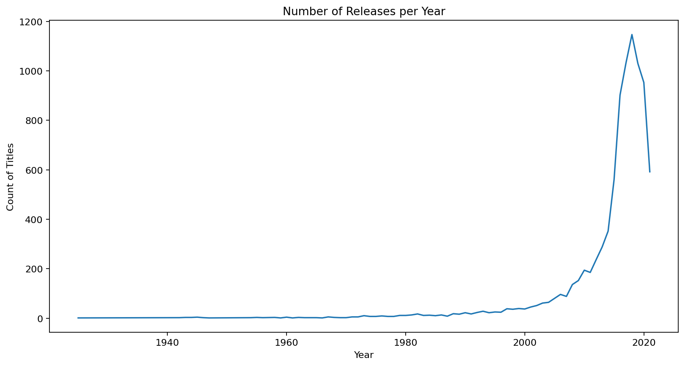

# 📊 CodeAlpha Internship Task 2: Exploratory Data Analysis (EDA) on Netflix Data

## Project Overview
This project performs a comprehensive Exploratory Data Analysis (EDA) on a dataset of movies and TV shows on Netflix, completed as part of the **CodeAlpha Data Science Internship**.

The goal was to clean the raw data, engineer new features, and provide actionable insights into Netflix's content catalog using Python.

## Key Project Steps
* **Data Cleaning:** Handled missing values (imputed 'Not Given' for key columns like director/cast).
* **Feature Engineering:** Created the **'decade'** column from the 'release_year' for trend analysis.
* **Analysis:** Analyzed content split (Movie vs. TV Show), top creators, and country contributions.

## Key Insights & Visualizations

### 1. Content Release Trends Over Time
- **Insight:** Content acquisition has grown dramatically, peaking around **2018-2020**, showing aggressive expansion before a slight drop.

### 2. Content Distribution (Movie vs. TV Show)
- **Insight:** **Movies significantly outnumber TV Shows (approx. 70% vs. 30%)** in the current catalog.
  ### 3. Top Genres
- **Insight:** **Dramas, Comedies, and International Movies** are the most prevalent categories on the platform.
  ## Technologies and Libraries Used
* **Python**
* **Pandas** (Data Manipulation and Cleaning)
* **Matplotlib / Seaborn** (Data Visualization)
* **Jupyter Notebook / VS Code**

## How to View
The complete analysis and code are available in the `netflix_eda.ipynb` file.
